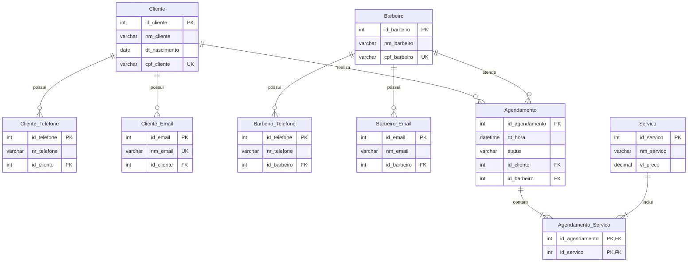

# Diagrama de Entidade Relacionamento (DER) - Barbearia Prime

Este documento apresenta o Diagrama de Entidade Relacionamento (DER) do banco de dados da **Barbearia Prime**, mapeado a partir do script SQL físico em [bd-MySQL-barbearia.sql](file:///c:/Users/Usuario/Downloads/barbearia/database/bd-MySQL-barbearia.sql).

---

## 1. Diagrama Lógico/Físico (Mermaid)

O diagrama abaixo ilustra as entidades, atributos (com tipos de dados e chaves) e as relações de cardinalidade entre elas.

---

## 2. Descrição das Entidades e Chaves

### 2.1. Entidades Principais
*   **Cliente**: Cadastro dos clientes contendo nome completo, data de nascimento e CPF (único).
*   **Barbeiro**: Profissionais da barbearia contendo nome completo e CPF (único).
*   **Servico**: Catálogo de serviços oferecidos (ex: Corte de Cabelo, Barba) com seus respectivos preços.
*   **Agendamento**: Registro de horários agendados pelos clientes com um barbeiro específico.

### 2.2. Entidades de Apoio (Multivalorados)
*   **Cliente_Telefone** e **Cliente_Email**: Permitem o armazenamento de múltiplos telefones e e-mails para cada cliente.
*   **Barbeiro_Telefone** e **Barbeiro_Email**: Permitem múltiplos telefones e e-mails para os profissionais.

### 2.3. Relação Muitos-para-Muitos (N:N)
*   **Agendamento_Servico**: Tabela de junção (associativa) que permite que um único agendamento inclua múltiplos serviços, e que um mesmo serviço esteja associado a vários agendamentos. A chave primária é composta pelas chaves estrangeiras `id_agendamento` e `id_servico`.
